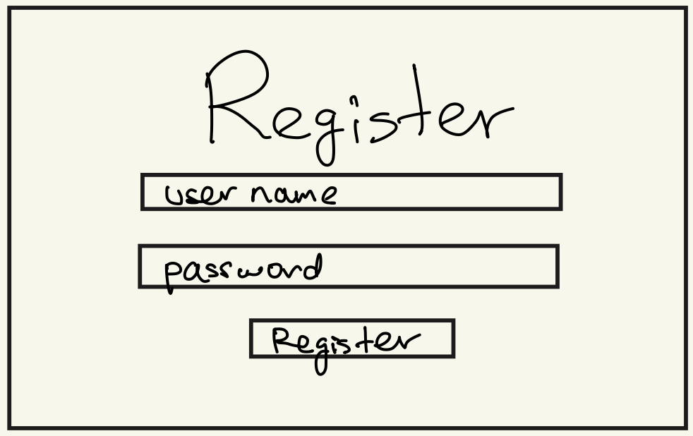
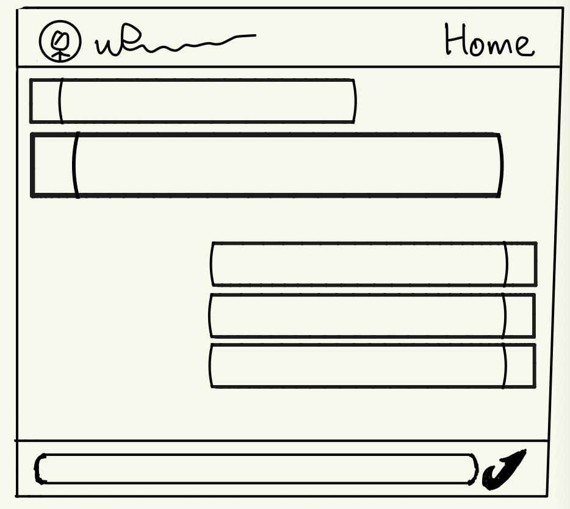
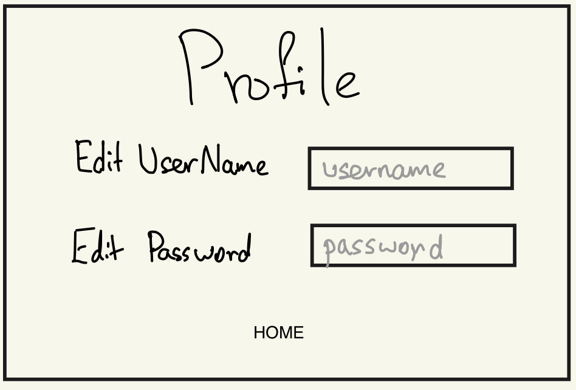

# CipherChat

## Overview

CipherChat is a small end-to-end encrypted (E2EE) web messaging application built using Express and MongoDB. It allows users to securely register, log in, and exchange encrypted messages with each other — similar in spirit to Signal or WhatsApp, but in a much smaller scope for demonstration purposes.

Each user generates a public/private key pair upon registration. When one user sends a message to another, the plaintext message is encrypted in the browser using a shared secret key derived via Elliptic-Curve Diffie–Hellman (ECDH), ensuring that messages are stored encrypted on the server. Only the recipient, possessing the matching private key, can decrypt and read the message.

## Data Model

The application will store Users and Messages.

* Users can send and receive multiple messages (via references)
* Each message references both a sender and recipient user

An Example User:
```javascript
{
  username: "alice",
  passwordHash: "<bcrypt hash>",
  publicKey: "-----BEGIN PUBLIC KEY----- ..."
}
```

An Example Message:
```javascript
{
  sender: // a reference to a User object
  recipient: // a reference to a User object
  ciphertext: "e3a2d91fa81c...",
  iv: "f9c1c2b3a4d5e6f7a8b9c0d1",
  timestamp: ISODate("2025-10-29T10:05:00Z")
}
```

## [Link to Commented First Draft Schema](db.mjs) 

## Wireframes

/register - page for user registration



/login - page for user login


/home - page showing contact list


/chat/:username - page for chatting with a specific user



/profile - page for editing user profile



## Site map
```
           [Login] <--> [Register]
              |
              |
           [Home]
            /   \
           /     \
      [Profile] [Chat (per contact)]
```

## User Stories or Use Cases

1. as non-registered user, I can register a new account with the site
2. as a user, I can log in to the site
3. as a user, I can see my contact list and choose someone to message
4. as a user, I can send an encrypted message to another user
5. as a user, I can view previously exchanged encrypted messages that decrypt only on my device
6. as a user, I can update my username or password from my Profile page

## Research Topics

* (3 points) Unit testing with Jest
    * I'm using Jest to test encryption/decryption functions and database operations
    * Will link to testing code in repository and show screen capture of tests
    * see [Jest Testing Framework](https://jestjs.io/docs/getting-started)
* (3 points) Socket.io for real-time messaging
    * I'm using Socket.io (server-side library) to enable instant message delivery without page refresh
    * This creates a more responsive chat experience similar to WhatsApp
    * see [Socket.io Documentation](https://socket.io/docs/v4/)
* (2 points) Tailwind CSS
    * I'm using Tailwind for responsive layout and consistent styling
    * Will customize the default theme (not using stock configuration)
    * see [TailwindCSS Documentation](https://tailwindcss.com/docs)
* (3 points) Web Crypto API for client-side encryption
    * I'm using Web Crypto API to implement ECDH key exchange and AES-GCM encryption
    * This is a client-side cryptography implementation for end-to-end encryption
    * Will link to encryption/decryption code and demonstrate working encrypted messaging
    * see [MDN Web Crypto API](https://developer.mozilla.org/en-US/docs/Web/API/Web_Crypto_API)


## [Link to Initial Main Project File](app.mjs) 

## Annotations / References Used

1. [MDN Web Docs – Web Crypto API](https://developer.mozilla.org/en-US/docs/Web/API/Web_Crypto_API) - for ECDH and AES-GCM implementation
2. [Socket.io Documentation](https://socket.io/docs/v4/) - for real-time messaging
3. [Mongoose Documentation](https://mongoosejs.com/docs/) - for schema design
4. [TailwindCSS Documentation](https://tailwindcss.com/docs) - for styling
5. [Jest Testing Framework](https://jestjs.io/docs/getting-started) - for unit testing
